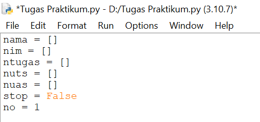
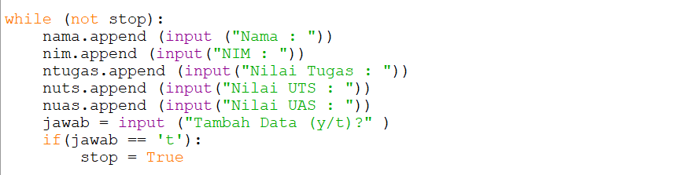
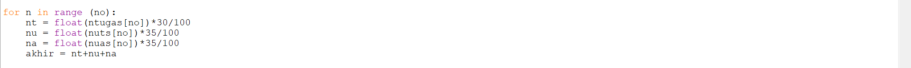
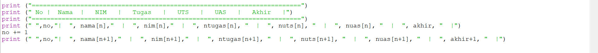
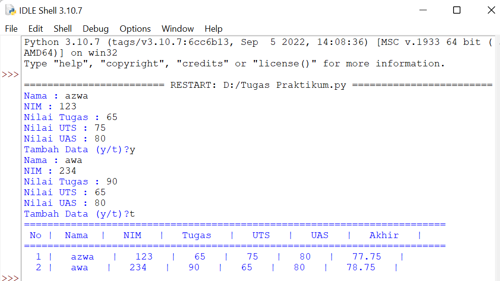

### Membuat program sederhana untuk menambahkan data kedalam sebuah list

langsung saja ke langkah-langkahnya:

1. Buat semua variablenya,dan jangan lupa disini beberapa variable kita gunakan LIST(Ditandai dengan tidak ada nilai yang dimasukan dan hanya ada simbol"[]")

2. Buat sebuah perulangan,tujuannya karena kita ingin memasukan beberapa data sekaligus. saya pakaki while, dan didalam perulangan inilah kita masukan perintah untuk input data yang kita butuhkan.Dengan menggunakan syntax"variable.append." saya bertujuan untuk memasukan data pada variable-variable list yang sudah saya buat tadi.Berikut gambarnya :

3. Nah sekarang kita buat Nilai akhir menggunakan for dan saya buat lagi variable-variable lokal yang dipakai hanya buat perhitungan saya. Karena ada satu bagian di dalam tabel yaitu nilai akhir yang merupakan perhitungan dari 30% TUGAS. 35% UTS, dan 35% UAS. Dan disini juga kita konversi nilai variable yang tadinya string menjadi float,supaya bisa dihitung.

4. Dan setelah itu kita buat tabel print nya.

5.Run program yang sudah dibuat dan lihat hasilnya.
dan seperti inilah penampilannya :

Sekian Dan Terima Kasih